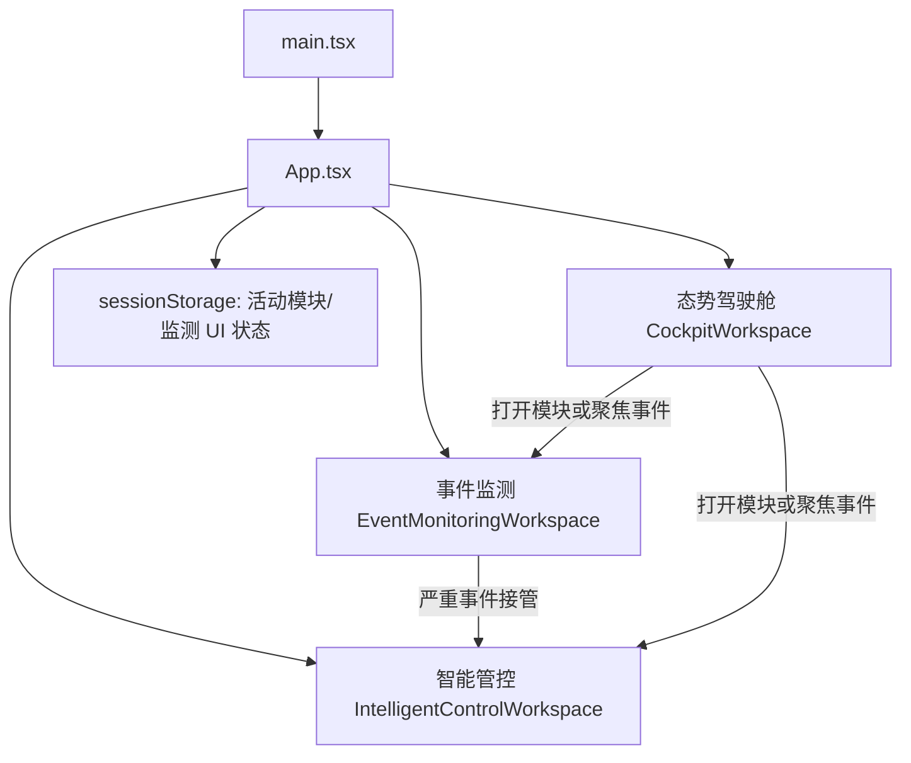
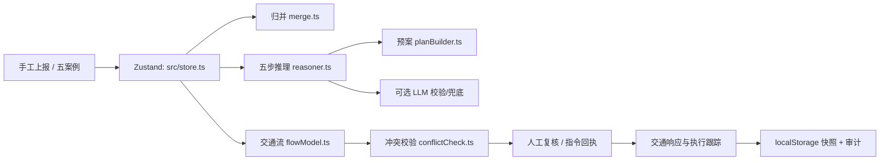
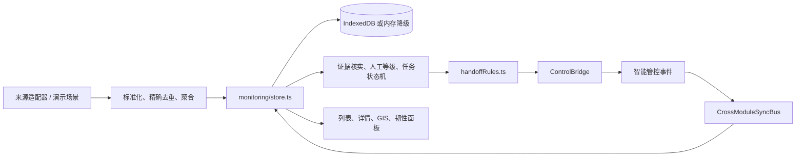

# README_FOR_AI · 路网综合管控智能体 MVP

> **用途**：本文件是项目的工程 Harness + Long-term Memory。后续 Codex 在分析、修改或验证代码前，应先阅读本文件，再按文中的证据优先级和工作协议开展任务。
>
> **最后核查**：2026-09-02（Asia/Shanghai）
> **代码基线**：`main` / `cd0d5e5`（`事件监测模块新增24个演示案例`）
> **工作区状态**：存在未提交修改；本文件不代表这些修改已经验收或可提交。
> **适用范围**：仓库根目录、`demo/` 前端 MVP、事件监测子模块及配套产品/验收文档。
> **可信度规则**：当前代码与测试 > 当前 Git 状态 > 已批准产品/验收文档 > 历史 README 和变更日志。无法由代码确认的内容必须标为“待确认”或“历史结论”。

---

## 1. 文档用途与维护规则

### 1.1 本文件回答什么

本文件应让一个没有上下文的新 Codex 能够回答以下问题：

- 项目当前是做什么的、哪些事情明确不做；
- 代码从哪个入口启动，模块如何分层，数据如何跨模块流转；
- 当前哪些能力已实现、哪些只是演示/仿真、哪些仍待验收；
- 哪些业务规则、数据口径和降级策略不能被重构破坏；
- 哪些区域修改风险最高、应运行哪些定向测试；
- 当前工作区里哪些改动属于用户，必须原样保留。

### 1.2 更新触发条件

发生以下任一变化时，同步更新本文件的相应段落：

1. 新增或替换模块入口、Store、持久化策略、跨模块契约或外部适配器；
2. 修改事件状态机、预案状态机、接管幂等规则、权限或人工复核门禁；
3. 新增/变更演示案例、回归数值锚点、验收结论或已知风险；
4. 生产边界、数据来源、LLM/地图依赖或安全策略发生变化；
5. 修复一次会导致未来重复踩坑的故障。

不得把计划、界面占位或单纯存在的文件写成“已交付”。

### 1.3 P0 工程治理规则（已确认）

以下规则优先于一般开发便利性；不满足时必须停下并向用户说明影响，不得自行扩大范围。

#### 变更授权边界

- 默认可直接完成：用户明确提出、在既有模块边界内、且**不改变业务规则或对外行为**的代码、测试和文档修改。
- 必须先获得用户显式确认：新增/升级依赖；持久化 schema 或数据迁移；权限、状态机或接管语义改变；真实外部接口、凭证或生产数据接入；删除/重置业务数据；Git 提交、推送、建分支；向外部系统或人员发送内容。
- 发现当前代码、产品文档和用户指令冲突时，先列出冲突与影响，不能以“现有代码如此”自行决定产品行为。

#### 完成与验证门禁

- 功能性改动必须补充或更新能覆盖改动风险的自动化测试；仅改文案/格式且不改变行为时可不新增测试，但必须说明理由。
- 先跑定向测试，再跑 `npm run check`；测试、lint、构建或浏览器验收无法执行时，必须写明命令、失败原因和未验证范围。
- 禁止用“理论上通过”“历史报告曾通过”“未改相关代码”替代当前验证；未验证不得称为完成、通过或交付闭环。
- 改动产品契约、验收口径、关键约束、架构边界或历史踩坑时，同步更新相关 PRD/验收记录/代码修改日志和本文件；若不更新，需在交付中说明原因。

#### 数据与安全红线

- 仓库源码、案例、测试夹具、截图、导出物、日志和提交信息中，不得写入真实个人信息、车牌、人脸、电话号码、生产密钥、生产接口响应或未脱敏现场素材。
- 如确需使用真实数据，必须先获得用户显式授权，并记录脱敏方法、使用范围、保存位置和保留/清理方式。
- 演示、仿真、预测和接报事实必须持续分开标识；不得通过界面、导出或 LLM 文案混淆其来源。

#### 快照与新鲜度

- 分支、提交、脏工作区、验收结果和运行环境都是核查快照；新任务开始前或 Git 状态变化后必须重新检查，不得将旧快照表述为“当前”。
- 本文件中的“历史结论”必须保留来源文件和日期；无来源的经验只能标为“待确认”或“技术建议”。

---

## 2. 项目概览与产品边界

### 2.1 项目定位

这是面向**高速公路运行监测与应急处置**的单机前端 MVP。它以事件为主线，提供两类互相衔接的能力：

1. **事件监测**：接收和标准化告警、去重/聚合、视频与证据核实、人工确认等级、严重事件接管，以及处置状态回写；
2. **智能管控**：事件归并、事理图谱推理、交通流计算、预案构建与人工复核、指令回执、交通响应和审计留痕。

项目用于产品方案验证、业务演示和前端研发联调。当前路网、桩号、设备、资源、交通流、视频和雷视数据均为内置案例、动态演示数据或仿真数据，**不得**作为生产调度、导航、测绘、执法或真实应急决策依据。

### 2.2 当前 MVP 范围

- 浏览器内 React 前端；
- 事件监测与智能管控在同一应用壳内切换；
- 内置案例、人工输入、浏览器本地存储和本地消息总线模拟业务闭环；
- 可选高德地图与 OpenAI 兼容 LLM 增强；
- 可复现的单元/集成测试与演示场景。

### 2.3 明确不在当前范围内

- 真实视频、雷达、摄像机或传感器原始数据接入与算法推理；
- 生产 GIS、真实派单/指令下发、后端审计库、统一身份认证和多用户服务端协同；
- 自动改变驾驶行为的控制措施、责任认定或执法判断；
- 移动端验收；
- 把模型预测、演示门架数据或雷视仿真伪装成生产实测。

正式化前需补服务端安全代理、鉴权与数据范围、数据治理、可观测性、真实接口契约和生产审计。

---

## 3. 当前项目状态

### 3.1 版本与工作区

截至本次核查，当前分支为 `main`，最近提交为 `cd0d5e5`。工作区存在用户未提交变更，主要集中在：

- `demo/src/monitoring/components/`：证据、核实、事件详情和视频卡片交互/样式；
- `demo/src/monitoring/engine/degradation.ts` 与运行时：依赖降级表现；
- `demo/src/monitoring/store.ts`、`uiState.ts`：监测模块状态；
- 相关 Vitest 测试、`产品文档/事件监测模块_PRD_v0.3.md`；
- 另有一个被删除的大型视觉稿和未跟踪的 `.claude/settings.local.json`。

这些变更不是本文件产生的，也不能默认已经完成验收。任何任务开始前先运行 `git status --short`，只修改当前任务涉及的文件。

### 3.2 已实现且可由代码确认的主链

- 应用壳支持 **态势驾驶舱 / 事件监测 / 智能管控** 三种视图；当前模块选择保存于 `sessionStorage`。
- 智能管控支持事件接入、归并、五步推理、交通流计算、预案构建/比较、人工确认、指令回执、交通响应、终报与数据集导出。
- 事件监测拥有独立领域模型、Zustand Store、IndexedDB 仓储、内存降级、模拟用户权限、核实状态机、严重事件接管、双向同步和监测 GIS 模型。
- 事件监测到智能管控的接管通过本地 `ControlBridge` 和 `CrossModuleSyncBus` 模拟；代码保留幂等键、版本与序列号语义。
- 外部 LLM 失败、Schema 校验失败或值级溯源不通过时，智能管控回退本地模板/规则结论；监测视频或存储不可用时须显示明确降级状态。

### 3.3 历史验收结论与当前限制

`产品文档/事件监测模块_阶段11全量验收与交付报告_v0.2.md` 记录的历史结论是：P0 代码链路和自动化验收通过；26 条 AC 中 24 条通过、AC-18 部分通过、AC-19（真实浏览器连续 2 小时稳定性）未完成。浏览器视觉、响应式、真实时延和 2 小时墙钟验收不可宣称完成。

本次核查未能重新执行 `npm run check`：当前沙箱没有可用的 `npm`，直接运行 `pnpm exec oxlint` 也无法找到本地可执行文件。因此，**本轮未重新验证 lint、Vitest、TypeScript 或生产构建**；历史报告只能作为历史证据，不能替代当前工作区验证。

---

## 4. 技术栈与运行方式

| 层面 | 当前实现 |
| --- | --- |
| UI | React 19、TypeScript、Vite |
| 状态 | Zustand：智能管控 `src/store.ts`，事件监测 `src/monitoring/store.ts`，UI 辅助状态独立保存 |
| 样式 | Tailwind CSS 4、Arco 风格令牌、模块 CSS |
| GIS/图表 | 高德地图 JavaScript API 2.0、Recharts；无地图能力时必须可降级 |
| 智能增强 | OpenAI 兼容 `/chat/completions`，支持 Qwen / DeepSeek / Kimi / 自定义配置 |
| 智能管控持久化 | `localStorage`：运行快照和只增审计流 |
| 事件监测持久化 | IndexedDB：`roadgov-monitoring-mvp`，当前 schema version 为 `2`；不可用时回退内存并提示 |
| 质量工具 | Oxlint、Vitest、`tsc -b`、Vite build |

### 4.1 常用命令

以下命令应在 `demo/` 目录执行：

```bash
npm ci
npm run dev
npm run lint
npm run test
npm run build
npm run check
npm run preview
npm run audit:deps
```

`npm run check` 顺序为 lint → Vitest → TypeScript/Vite build。`predev` 会运行 `scripts/sync-llm-keys.mjs`；不要把真实密钥写进源码、案例、日志或提交记录。

### 4.2 配置与安全

- 本地配置入口为 `demo/.env.local`（参考 `.env.local.example`）；地图和 LLM 均是可选增强。
- 前端环境变量会暴露到浏览器，只适合本地演示；生产调用必须迁移到服务端代理。
- `.env.local` 与 `demo/API KEY.txt` 不可提交；变更环境变量后重启 Vite。

---

## 5. 目录结构与模块职责

```text
road_goven_mvp/
├─ demo/                         # 可运行 React/Vite 应用
│  ├─ src/
│  │  ├─ components/             # 智能管控工作台、布局、弹窗和展示组件
│  │  ├─ data/                   # 路网、设备、资源、案例、图谱与措施模板
│  │  ├─ domain/                 # 事件、预案、审计、接管等领域类型
│  │  ├─ engine/                 # 智能管控纯业务算法与单元测试
│  │  ├─ gis/                    # 路网几何、共享孪生模型、高德覆盖物适配
│  │  ├─ monitoring/             # 事件监测子域（独立状态、仓储、引擎、GIS、组件）
│  │  ├─ services/               # 智能管控 localStorage 与 LLM 服务
│  │  ├─ App.tsx                 # 应用壳和三模块切换入口
│  │  └─ main.tsx                # React 挂载入口
│  ├─ scripts/                   # 开发前配置同步脚本
│  └─ README.md                  # 运行版详细说明
├─ 产品文档/                     # MVP SRS、事件监测 PRD、验收报告和执行文档
├─ 代码修改日志/                 # 已完成阶段的变更记录和历史问题
├─ 事件案例/                     # 智能管控五案例资料
├─ AI评审意见/                   # 审计与验收历史资料
├─ scripts/、tools/              # 文档生成/校验辅助工具，不属于应用运行时
├─ README.md                     # 面向使用者的项目说明
└─ README_FOR_AI.md              # 本文件
```

### 5.1 智能管控模块

| 区域 | 主要职责 | 关键入口 |
| --- | --- | --- |
| `src/store.ts` | 单一业务编排 Store；串联接入、推理、预案、时钟、回写和审计 | `useStore` |
| `src/engine/` | 纯函数业务算法；不得反向依赖 UI 或 Store | `ingest.ts`、`reasoner.ts`、`flowModel.ts`、`planBuilder.ts`、`tms.ts` |
| `src/gis/` | 地图共享业务模型、高德适配、孪生展示 | `twinMapModel` 及高德覆盖物模块 |
| `src/services/llm.ts` | LLM 请求、JSON/Schema/值级溯源校验与本地兜底 | LLM 生成函数 |
| `src/services/persistence.ts` | 运行快照与只增审计流 | `RuntimeSnapshot` version `3` |
| `src/data/` | 静态道路、设施、资源、事理图谱和五个案例 | `demoCases.ts` |

### 5.2 事件监测模块

| 区域 | 主要职责 | 关键入口 |
| --- | --- | --- |
| `src/monitoring/components/` | 监测列表、视频卡片、详情抽屉、证据、核实、GIS、韧性与演示工具 | `EventMonitoringWorkspace.tsx` |
| `src/monitoring/store.ts` | 监测领域编排、权限、告警接收、核实、接管、回写和审计 | `createMonitoringStore` |
| `src/monitoring/engine/` | 标准化、去重/聚合、等级、核实状态机、接管规则、降级、指标 | 纯函数 + 对应 `*.test.ts` |
| `src/monitoring/services/monitoringDb.ts` | IndexedDB/内存仓储、事务、版本冲突与接管幂等约束 | `createDefaultMonitoringRepository` |
| `src/monitoring/services/monitoringDemoRuntime.ts` | 演示事件引入、连接状态和视频依赖模拟 | `monitoringDemoRuntime` |
| `src/monitoring/services/controlBridge.ts` | 监测→管控接管端口、重试和幂等映射 | `ControlBridge` |
| `src/monitoring/services/crossModuleSync.ts` | 本地双向同步总线、全局顺序与补拉 | `crossModuleSyncBus` |
| `src/monitoring/adapters/` | 演示场景和外部来源适配边界 | `DemoMonitoringAdapter` |
| `src/monitoring/gis/` | 监测事件 GIS 共享模型与高德覆盖物 | `monitoringGisModel.ts` |
| `src/monitoring/permissions.ts` | 模拟用户、权限点及演示设施白名单 | `SIMULATED_USERS` |

---

## 6. 核心架构与关键调用链

### 6.1 应用壳与模块切换



`App.tsx` 初始化事件监测 Store 并连接 `monitoringDemoRuntime`。开发模式或 `VITE_MONITORING_DEMO_TOOLS=true` 时，会加载默认演示事件；默认案例加载失败时，界面保留已持久化事件可见性并切至全量范围。

### 6.2 智能管控主链



五步推理、条件求值、交通流和预案构建属于业务引擎；`store.ts` 负责顺序编排，组件主要负责渲染和触发 action。地图业务状态必须沉淀到 `gis/` 共享模型，避免组件和地图分别计算导致显示不一致。

### 6.3 事件监测到智能管控的闭环



接管不是简单跳转：它保留 `handoffId`、`correlationId`、`idempotencyKey`、事件版本和全局 `streamSequence`。同一幂等键必须得到同一映射；重复接管、版本冲突、失败重试和乱序回写都需要维持既有保护。

---

## 7. 关键业务规则、数据流与状态

### 7.1 智能管控不可破坏的规则

- 控制类措施必须人工确认；系统只能给出处置建议，不能替代现场指挥权。
- 低置信或信息不全时，必须显式标识“待核实/依据不足”，并回退规则结论或转人工。
- `PlanningGap` 只能表达事实摘要、风险提示和非执行建议，**不得**进入措施确认或下发队列；补全参数、来源和复核后才能成为 `Measure`。
- 新预案版本生成时，旧版转为“已被替换”；措施逐条记录继承/新增/撤销/降级。
- 智能管控运行快照和审计流都要兼容当前 `RuntimeSnapshot` version `3`，修改字段需提供迁移/缺省策略。

### 7.2 事件监测不可破坏的规则

- 监测建议等级 `suggestedLevel` 与人工确认等级 `confirmedLevel` 必须分离；新证据可以更新建议等级，但不得静默覆盖人工等级。
- L3/L4 降级必须留依据；L4 降级、误报和持续观察需要班长复核/批准。
- 历史核实结论只追加订正，不覆盖原始记录。
- 视频失败时仍保留事件卡片、关键帧降级标识和受控证据引用；不能借故隐藏事件或伪造视频正常。
- IndexedDB 不可用时使用内存仓储，但必须显示“当前仅保存在内存，本次可能不留痕”；不能静默成功。
- 权限当前是演示用模拟用户 + 道路/设施白名单，不等于生产 RBAC。不可随意扩大道路级权限。
- 跨模块消息需保持序列、幂等、版本和关联 ID；不要将本地总线误当作生产消息中间件。

### 7.3 演示案例回归锚点

智能管控五案例仍是重要回归资产，详见 `事件案例/五个案例.md` 与 `src/data/demoCases.ts`：

| 案例 | 关键验证点 |
| --- | --- |
| 案例一 | 跨事件分流冲突、提前分流裁剪 |
| 案例二 | 资源链式挤兑与 ETA 比较 |
| 案例三 | 危化品、隧道、团雾、夜间等组合条件 |
| 案例四 | 事实撤回后的 TMS 撤销传导与预案版本演进 |
| 案例五 | 方案自引用检测和预测兑现 |

重构推理、流量、冲突或预案算法时，必须同步定位并更新相应 Vitest 断言；不可只改展示文案掩盖数值变化。

---

## 8. 持久化、外部依赖与降级

| 能力 | 当前实现 | 失败处理 | 不能做什么 |
| --- | --- | --- | --- |
| 智能管控运行态 | `localStorage` 快照/只增审计 | 内存回退与界面可见性 | 不把本地数据当服务端审计 |
| 事件监测运行态 | IndexedDB / 内存仓储 | `persistenceState`、`persistenceMessage` 明示降级 | 不静默丢失留痕 |
| 高德地图 | 浏览器地图与覆盖物适配 | GIS 不可用时保留核心业务信息 | 不把地图渲染成功等同数据真实 |
| LLM | OpenAI 兼容接口 | 网络/超时/schema/值级校验失败回退本地规则 | 不编造字段、数值、ETA、人员或处置状态 |
| 监测视频 | 演示运行时/受控证据 | 视频降级后保留卡片和证据引用 | 不展示不应显示的算法/文字证据 |
| 跨模块同步 | 内存消息总线 | 记录顺序、游标和补拉语义 | 不承诺跨浏览器或服务端可靠投递 |

---

## 9. 已知问题、历史踩坑与防回归

| 问题/风险 | 已知处理方式 | 后续修改注意事项 |
| --- | --- | --- |
| LLM 输出可能 400、超时、非 JSON、字段不全或编造数值 | `services/llm.ts` 进行请求失败处理、Schema 校验和值级溯源，失败回退本地规则 | 不绕过校验；模型文案必须区分接报事实、演示/仿真与预测 |
| 高德 JS API 初始化或加载失败 | 历史修改日志记录过失败缓存修复；业务页面需可降级 | 不将地图加载状态作为业务状态唯一来源 |
| 事件监测视频/存储/同步依赖不可用 | `degradation.ts`、运行时和韧性面板显式呈现降级 | 每个降级分支都需保持事件可见、审计可追溯或明确告警 |
| 接管重复提交、并发提交或断线重试 | `ControlBridge`、仓储唯一 `idempotencyKey` 和 in-flight 去重 | 不删除幂等检查，不以随机新 key 掩盖重试 |
| 监测与管控双向更新乱序 | `CrossModuleSyncBus` 按全局序列记录、Store 管理游标/已处理消息 | 不以 UI 当前状态覆盖版本更新，先验证关联 ID、版本和序列 |
| 使用演示数据得出生产结论 | 文案与 PRD 多处规定事实/仿真/预测分离 | 任何简报、导出和界面新增文本都必须保留来源与置信度说明 |
| 历史验收环境受 Windows sandbox/浏览器工具影响 | 阶段 11 报告保留浏览器烟测和 AC-19 未完成项 | 环境恢复后补做真实浏览器视觉、响应式、时延和 2 小时稳定性验收，不可只跑单测后宣称闭环 |

---

## 10. 高风险修改区域

| 区域 | 风险 | 最低检查 |
| --- | --- | --- |
| `demo/src/App.tsx`、`appShellState.ts` | 模块初始化、默认案例和跨模块导航 | 应用壳/监测工作区组件测试，手工切换三模块 |
| `demo/src/store.ts` | 智能管控主链集中编排，影响范围大 | 相关 engine 测试、案例回归、持久化兼容 |
| `demo/src/monitoring/store.ts` | 告警、核实、接管、回写、审计与降级集中编排 | 监测集成测试、接管/同步/降级测试 |
| `monitoringDb.ts` | IndexedDB schema、版本冲突、事务和幂等键 | 仓储与 ingestion 测试；不要破坏 version/索引 |
| `controlBridge.ts`、`crossModuleSync.ts` | 重试、去重、顺序和跨模块一致性 | 控制桥接、同步、交叉模块集成测试 |
| `demo/src/domain/` | 智能管控与监测领域类型（含 `monitoring.ts`、`handoff.ts`）的变动会穿透 Store、引擎、组件、适配器和测试 | TypeScript build + 全量引用搜索 |
| `services/llm.ts` | 输出可信度和安全边界 | Schema/值级验证与本地兜底相关测试 |
| `gis/`、`monitoring/gis/` | 地图与列表/工作台状态可能脱节 | GIS 模型测试、无地图降级与聚焦联动检查 |

### 10.1 P0 约束—影响文件—最低验证索引

| P0 约束 | 典型影响文件 | 最低验证 |
| --- | --- | --- |
| 事件归并、推理、流量、预案和五案例锚点不可无证据漂移 | `src/store.ts`、`src/engine/`、`src/data/demoCases.ts`、`src/domain/` | 对应 engine 单测 + 受影响案例回归；算法变化须核对案例锚点 |
| 控制类人工确认、PlanningGap 禁止下发、预案版本留痕 | `src/store.ts`、`src/engine/planBuilder.ts`、`src/engine/tms.ts`、预案组件 | 状态机/预案测试；确认、打回、作废、替换的审计可见性 |
| 建议等级与人工等级分离，L3/L4 审批不可绕过 | `src/domain/monitoring.ts`、`src/monitoring/store.ts`、`verificationMachine.ts`、核实组件 | 核实状态机、权限和详情抽屉测试 |
| 接管必须幂等、有序、可追溯，不能以重试制造重复事件 | `handoffRules.ts`、`controlBridge.ts`、`crossModuleSync.ts`、`monitoringDb.ts` | handoff、同步、仓储幂等和跨模块集成测试 |
| 本地持久化不可静默丢失；审计只增不改 | `services/persistence.ts`、`monitoringDb.ts`、两个 Store | 持久化/仓储测试；降级提示与刷新恢复检查 |
| LLM、地图、视频等依赖失败必须显式降级，且不能编造数据 | `services/llm.ts`、`monitoring/engine/degradation.ts`、运行时与韧性组件 | Schema/值级校验、降级分支和 UI 提示测试 |
| 真实数据、敏感信息和生产凭证不得进入仓库或导出物 | `.env.local`、案例、夹具、日志、导出与文档 | 变更前后检查 `git diff`；确认 `.gitignore` 和敏感内容扫描结果 |
| 产品契约、验收口径和架构约束变化必须可追溯 | 相关 PRD、验收报告、代码修改日志、本文件 | 文档差异审查；交付说明列出同步/未同步文档 |

---

## 11. Codex 工作协议

### 11.1 新任务开始前

1. 阅读本文件、根 `README.md`、`demo/README.md`，以及与任务相关的 PRD/验收报告。
2. 运行 `git status --short`，识别用户已有改动；默认不触碰未关联文件。
3. 从 `App.tsx`、相关 Store、domain、engine、services 和对应测试向下追踪，不依据文件名猜测实现。
4. 如果文档、代码和历史报告冲突，明确标注冲突，并按“当前显式用户指令 > 当前代码/测试 > 批准规格 > 历史文档”处理。

### 11.2 修改前的强制检查

- 改领域类型：搜索全部引用、持久化快照/IndexedDB schema、适配器和测试；
- 改状态机/权限/接管：先阅读 PRD 的相应 FR、Store action 与集成测试；
- 改 LLM：确认所有失败路径仍回退、所有输出仍经值级校验；
- 改 GIS：确认列表、详情、地图和跨模块焦点使用同一业务模型；
- 改演示数据：检查是否影响案例锚点、验收场景和文档；
- 改浏览器存储：提供旧版本读取或明确迁移/清理策略。

### 11.3 验证与汇报

优先跑任务相关测试，再跑 `npm run check`。若因环境、依赖或权限无法执行，报告具体命令、失败原因和未验证范围；不得声称通过。

最终汇报至少包含：变更文件、保持不变的关键约束、验证结果、已知限制，以及是否需要更新本文件。

---

## 12. 待确认事项

以下事项不能由当前前端代码单独确认，后续接入生产时必须显式决策：

- 真实视频/雷达/算法平台、GIS、管控下发和身份认证的接口契约、鉴权方式与故障语义；
- 生产 RBAC、机构数据范围、跨区域事件主协同关系和审计保留策略；
- 生产 LLM 的服务端代理、模型选择、成本/限流和数据脱敏策略；
- IndexedDB/localStorage 演示数据向后端数据服务迁移的版本与回滚方案；
- 浏览器视觉、响应式、性能/时延和连续 2 小时稳定性门禁的执行环境及验收证据。

---

## 13. 文档更新记录

| 日期 | 更新内容 | 依据 |
| --- | --- | --- |
| 2026-09-02 | 将旧“项目熟悉度总结”重构为 Harness + Memory；补充三模块应用壳、事件监测架构、双持久化、跨模块契约、当前脏工作区、历史验收边界、风险区域和 Codex 协议 | 当前 `demo/src`、`package.json`、`git status`、事件监测 PRD v0.3、阶段11验收报告 v0.2、代码修改日志 |
| 2026-08-24 | 原项目熟悉度总结 | 当时 README、产品文档、demo 源码、事件案例和修改日志 |
